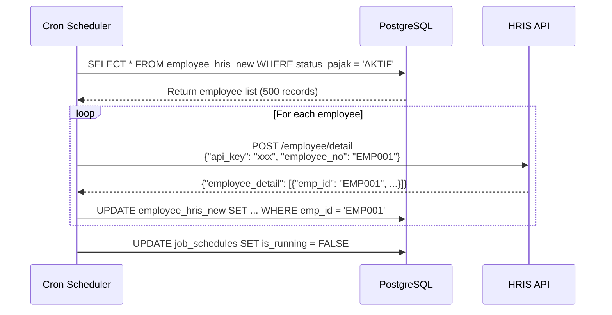
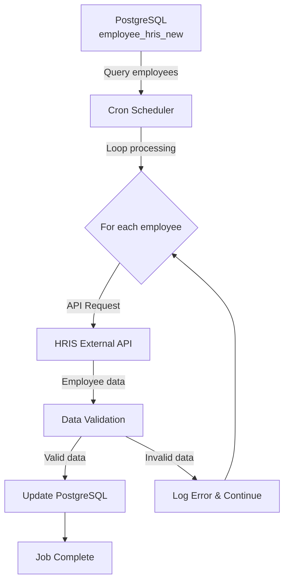
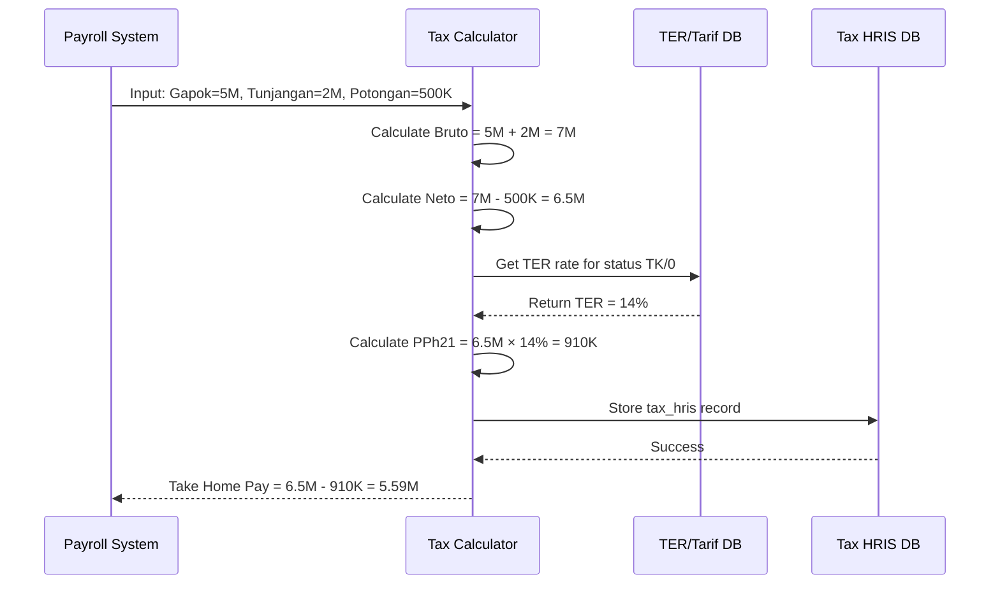
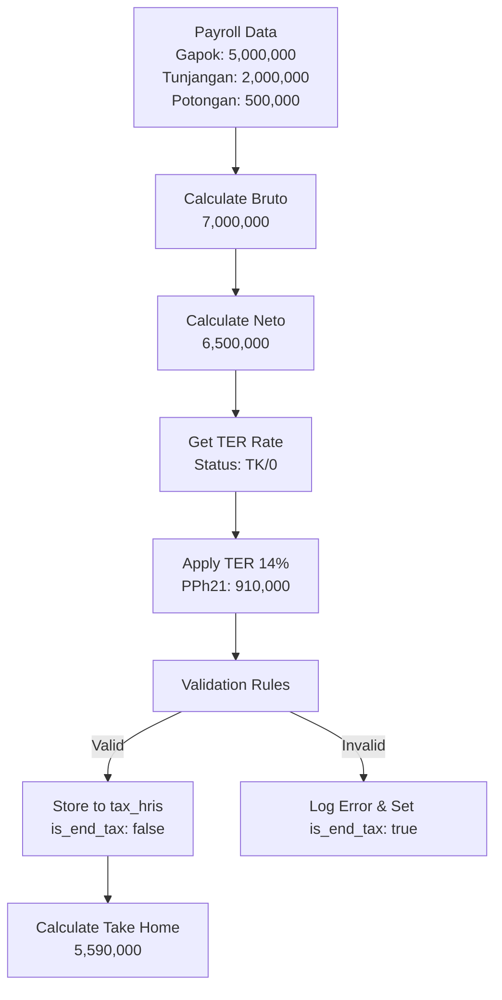

# Contoh Data Flow Loop antara PostgreSQL, Cron Service, dan HRIS DB

## Overview
Dokumen ini menjelaskan contoh konkret data yang diproses dalam loop antara PostgreSQL, cron service, dan HRIS database dalam sistem unitax.

## 1. Employee HRIS Data Flow

### Sequence Diagram


### Data Flow Diagram


### Scheduler Process
```go
// File: cron/schedulers/hris_scheduler.go
func RunScheduledEmployeeHRISData() {
    var employeeHRISDatas []models.EmployeeHRISNew
    
    // 1. Query PostgreSQL untuk ambil semua employee
    config.DB.Find(&employeeHRISDatas)
    
    // 2. Loop setiap employee
    for _, emp := range employeeHRISDatas {
        // 3. API call ke HRIS untuk setiap employee
        hrisemployeedetail.GetEmployeeHRISDetail(
            emp.EmpID, 
            emp.TipePajak, 
            emp.StatusPajak
        )
    }
}
```

### Contoh Data Employee yang Diloop
| EmpID | TipePajak | StatusPajak | Nama | NIK |
|-------|-----------|-------------|------|-----|
| EMP001 | PNS | AKTIF | John Doe | 3301012345670001 |
| EMP002 | NON_PNS | AKTIF | Jane Smith | 3301012345670002 |
| EMP003 | TETAP | TIDAK_AKTIF | Bob Johnson | 3301012345670003 |

### API Request/Response Detail

#### Request Payload
```json
{
    "api_key": "hris_secret_key_2024",
    "employee_no": "EMP001"
}
```

**Headers:**
```http
POST /api/employee/detail HTTP/1.1
Host: hris-api.university.ac.id
Content-Type: application/json
Authorization: Bearer xxx_token
```

#### Response Success (200 OK)
```json
{
    "status": "success",
    "message": "Employee data retrieved successfully",
    "timestamp": "2024-01-15T10:30:00Z",
    "employee_detail": [{
        "emp_id": "EMP001",
        "employee_display_name": "John Doe",
        "nip": "123456789",
        "nik": "3301012345670001",
        "npwp": "123456789123000",
        "alamat_ktp": "Jl. Sudirman No. 1, Jakarta",
        "alamat_npwp": "Jl. Sudirman No. 1, Jakarta",
        "employee_category": "DOSEN",
        "employment_status": "TETAP",
        "jenis_kelamin": "L",
        "email": "john.doe@university.ac.id",
        "posisi": "Dosen",
        "organization_unit": "Fakultas Teknik",
        "join_date": "2020-01-01",
        "gaji_pokok": "5000000",
        "tunjangan_total": "2000000",
        "status_aktif": true
    }]
}
```

#### Response Error (404 Not Found)
```json
{
    "status": "error",
    "message": "Employee not found",
    "timestamp": "2024-01-15T10:30:00Z",
    "error_code": "EMP_NOT_FOUND",
    "employee_detail": []
}
```

#### Response Error (500 Internal Server Error)
```json
{
    "status": "error",
    "message": "Internal server error",
    "timestamp": "2024-01-15T10:30:00Z",
    "error_code": "INTERNAL_ERROR",
    "details": "Database connection timeout"
}
```

## 2. Payroll PNS Data Flow

### Struktur Data Payroll
```go
type PayrollPNSEmployeeHRIS struct {
    ID             uuid.UUID
    Bulan          string    // "01", "02", "03", dst
    Tahun          string    // "2024", "2025"
    EmpNo          string    // "EMP001"
    Nama           string    // "John Doe"
    NIK            string    // "3301012345670001"
    StatusPajak    string    // "AKTIF"
    TipePajak      string    // "PNS"
    Gapok          string    // "5000000"
    Tunjangan      string    // "2000000"
    TunjanganPajak string    // "300000"
    Potongan       string    // "500000"
    PotonganPajak  string    // "100000"
    GajiBersih     string    // "6700000"
}
```

### Contoh Data Payroll yang Diproses
| EmpNo | Nama | Gapok | Tunjangan | Potongan | Gaji Bersih | Status |
|-------|------|-------|-----------|----------|-------------|---------|
| EMP001 | John Doe | 5,000,000 | 2,000,000 | 500,000 | 6,500,000 | PROCESSED |
| EMP002 | Jane Smith | 4,500,000 | 1,800,000 | 450,000 | 5,850,000 | PROCESSED |
| EMP003 | Bob Johnson | 6,000,000 | 2,500,000 | 600,000 | 7,900,000 | PENDING |

## 3. Job Scheduling Pattern

### Cron Job Configuration
```sql
-- Table: job_schedules
INSERT INTO job_schedules (job_name, next_run, is_running, is_manual) VALUES
('hris_employee_data', '2024-01-01 08:00:00', false, false),
('hris_payroll_data', '2024-01-01 09:00:00', false, false),
('hris_count_tax_scheduler', '2024-01-01 10:00:00', false, false);
```

### Update Schedule After Job Completion
```sql
UPDATE job_schedules
SET is_running = FALSE,
    last_run = (CURRENT_TIMESTAMP AT TIME ZONE 'Asia/Jakarta'),
    next_run = date_trunc('day', (CURRENT_TIMESTAMP AT TIME ZONE 'Asia/Jakarta') + INTERVAL '1 day')
WHERE job_name = 'hris_employee_data';
```

## 4. Data Processing Loop Examples

### Loop 1: Employee Sync
```
PostgreSQL → Query employees → Loop each employee → HRIS API call → Update PostgreSQL
```

**Contoh:**
1. Query: `SELECT * FROM employee_hris_new WHERE status_pajak = 'AKTIF'`
2. Loop: 500 employees
3. API calls: 500 requests ke HRIS
4. Updates: 500 records updated di PostgreSQL

### Loop 2: Payroll Data Processing
```
PostgreSQL → Query payroll data → Process tax calculation → Update results → HRIS sync
```

**Contoh:**
1. Query: `SELECT * FROM payroll_pns_employee_hris WHERE bulan = '01' AND tahun = '2024'`
2. Process: Hitung PPh 21 untuk setiap employee
3. Update: Simpan hasil perhitungan pajak
4. Sync: Kirim data ke HRIS jika diperlukan

### Loop 3: Tax Calculation

#### Tax Calculation Sequence Diagram


#### Tax Calculation Data Flow


**Contoh data yang dihitung:**
- **Input**: Gapok=5,000,000, Tunjangan=2,000,000, Potongan=500,000
- **Penghasilan Bruto**: Gapok + Tunjangan = 7,000,000
- **Penghasilan Neto**: Bruto - Potongan = 6,500,000  
- **TER Rate**: 14% (berdasarkan status TK/0)
- **PPh 21**: 6,500,000 × 14% = 910,000
- **Take Home Pay**: Neto - PPh 21 = 5,590,000

## 5. Error Handling dalam Loop

### Contoh Error Scenarios
```go
for _, emp := range employeeHRISDatas {
    err := hrisemployeedetail.GetEmployeeHRISDetail(emp.EmpID, emp.TipePajak, emp.StatusPajak)
    if err != nil {
        log.Println("Gagal get data pegawai:", err)
        // Continue dengan employee berikutnya, tidak stop seluruh proses
        continue
    }
}
```

### Typical Error Cases
- **API Timeout**: HRIS server tidak respond
- **Invalid Employee**: Employee ID tidak ditemukan di HRIS
- **Data Validation**: Format data tidak sesuai
- **Database Error**: Gagal save ke PostgreSQL

## 6. Performance Considerations

### Batch Processing
- **Chunk size**: Process 100 employees per batch
- **Rate limiting**: 10 requests per second ke HRIS API
- **Timeout**: 3600 seconds per API call
- **Retry logic**: 3x retry dengan exponential backoff

### Monitoring
```go
// Job logging untuk tracking
jobLog := &models.JobLog{
    JobName:      "hris_employee_data",
    StartedAt:    time.Now(),
    FinishedAt:   time.Now(),
    Status:       "success", // atau "failed"
    ErrorMessage: "",
    IsManual:     false,
}
```

## Kesimpulan

Data flow loop dalam sistem ini mengikuti pattern:
1. **PostgreSQL** sebagai source of truth untuk data internal
2. **Cron Service** sebagai orchestrator yang menjalankan job terjadwal
3. **HRIS DB** sebagai external system yang menyediakan data employee dan payroll
4. **Loop processing** untuk sinkronisasi data secara bertahap dan terkontrol